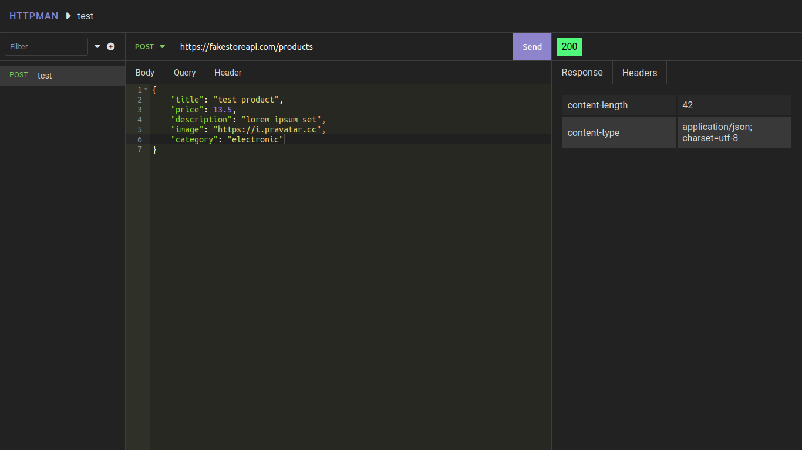

# HTTPMAN

A simple and stupid HTTP Client for testing REST API(s)



## Getting Started

### Dependencies

* Git
* Node

### Installing

* Clone this repo
* `cd` into the repo and run `yarn install` to install all the dependencies

### Executing program

If you have dependencies installed run this

```sh
yarn start
```

## TODO

- [ ] Add JSON stytax checker

## Author

[@Siddharth_Roy12](https://twitter.com/Siddharth_Roy12)

## License

This project is licensed under the MIT License - see the LICENSE.md file for details
